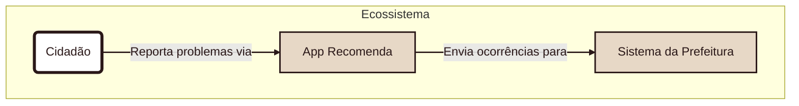

# Documentação de Arquitetura - App Recomenda
Este documento descreve a arquitetura do aplicativo seguindo o Modelo C4.

## Nível 1: Diagrama de Contexto do Sistema
Diagrama que mostra a visão geral do sistema, seus usuários e as interações com sistemas externos.



---
## Nível 2: Diagrama de Containers
Este diagrama dá um zoom no "App Projeto Recomenda" e mostra os principais blocos de tecnologia que o compõem.

````mermaid
graph TD
    subgraph "Sistema"
        U(Cidadão) -- Usa --> A;
        A(App Mobile em React Native) -->|Envia requisições| B(API Backend em Node.js);
        B -->|Lê e escreve| C[(Banco de Dados PostgreSQL)];
    end

    %% Estilização
    style U fill:#FFFFFF,stroke:#334635,stroke-width:4px,color:#334635
    style A fill:#89AF8C,stroke:#334635,stroke-width:2px,color:#334635
    style B fill:#89AF8C,stroke:#334635,stroke-width:2px,color:#334635
    style C fill:#89AF8C,stroke:#334635,stroke-width:2px,color:#334635
    linkStyle default stroke:#89AF8C,stroke-width:2px,color:#FFFFFF

````
